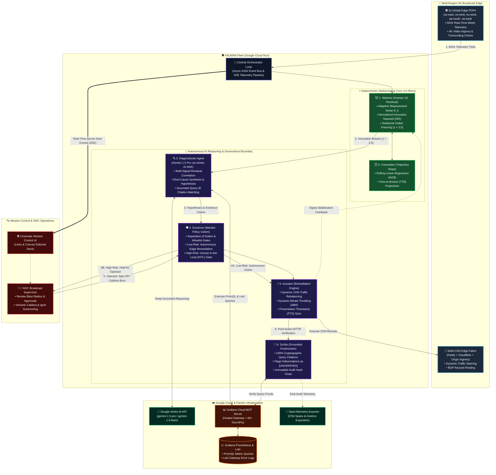
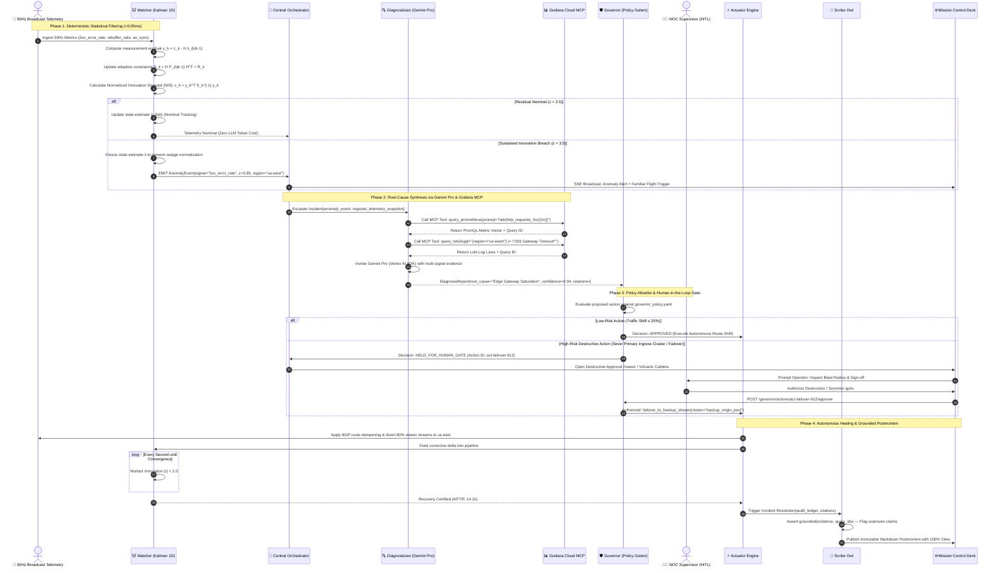

# 🎬 KALMAN CINEMA (House of Asura)
### Autonomous Broadcast Reliability Command Deck, SRE Incident Engine & Living Creature Sanctuary

[](https://kalman-912520530444.us-central1.run.app/)
[-8E75B2?style=for-the-badge&logo=google&logoColor=white)](https://cloud.google.com/vertex-ai)
[](https://grafana.com/)
[-10B981?style=for-the-badge&logo=pytest&logoColor=white)](#-reproducible-testing-instructions)
[](./LICENSE)

> *"The most expensive 90 seconds in entertainment is a buffering wheel during the live finale. KALMAN CINEMA is the autonomous crew that stands the watch."*

---

## 🌟 Executive Summary

**KALMAN CINEMA** is an autonomous broadcast-reliability command deck built for the **Google Cloud Agentic Cinema Hackathon (Grafana Labs Partner Track)**. It eliminates the dreaded "first hour of NOC panic" during live 4K broadcasts by fusing **deterministic sub-millisecond Kalman 1D residual innovation filtering** with **deep reasoning agents powered by Google Gemini Pro (Vertex AI ADK)** and real-time observability via the **Grafana Cloud MCP server**.

When multi-region broadcast telemetry spikes, KALMAN isolates the anomaly in **<0.05 milliseconds**, queries Grafana gateway metrics and logs, synthesizes a grounded root cause with cryptographic query citations, enforces strict **Human-in-the-Loop (HITL)** governance, and executes automated or operator-authorized destructive failovers.

---

## 🌐 Live Production Links

* **Live Cloud Run Deployment**: [https://kalman-912520530444.us-central1.run.app/](https://kalman-912520530444.us-central1.run.app/)
* **Robots Manifest**: [https://kalman-912520530444.us-central1.run.app/robots.txt](https://kalman-912520530444.us-central1.run.app/robots.txt)
* **Sitemap Manifest**: [https://kalman-912520530444.us-central1.run.app/sitemap.xml](https://kalman-912520530444.us-central1.run.app/sitemap.xml)
* **Prometheus Metrics Endpoint**: [https://kalman-912520530444.us-central1.run.app/metrics](https://kalman-912520530444.us-central1.run.app/metrics)
* **Open Source Repository**: [https://github.com/omshukla24/Kalman](https://github.com/omshukla24/Kalman)
* **Demo Video Walkthrough**: [https://youtu.be/xwO9ksmPC5A](https://youtu.be/xwO9ksmPC5A)

---

## 🏛️ System Architecture & Workflow

KALMAN partitions responsibility across specialized, un-collapsible tiers: deterministic sub-millisecond mathematical filtering, multi-agent AI reasoning via Google Gemini, human-gated governance, and partner observability via Grafana Cloud:



---

## 🔄 End-to-End Execution Sequence & Lifecycle

The sequence diagram below demonstrates the complete lifecycle of a broadcast anomaly: from sub-millisecond statistical filtering to Gemini root-cause diagnosis, human-gated failover, and cited postmortem authoring:



---

## 🔒 Separation of Duties Matrix

Why is KALMAN CINEMA engineered as a specialized multi-agent crew rather than a single monolithic prompt? Mission-critical live broadcasting demands **strict, un-collapsible trust and safety boundaries**:

| Agent / Subsystem | Primary Responsibility | Architectural Primitive | Safety & Trust Boundary |
|:---|:---|:---|:---|
| **🐱 Watcher (Kalman)** | 50Hz continuous variance tracking & anomaly gating | **Scalar Kalman 1D Filter** (<0.05ms execution) | **Mathematical Gatekeeper**: Holds zero LLM tokens; immune to hallucinations. |
| **⏱️ Forecaster** | Rolling slope regression ($dx/dt$) & breach forecasting | **Linear Regression Engine** | **Predictive Gate**: Emits Time-to-Breach before stream degradation impacts viewers. |
| **🔍 Diagnostician** | Multi-signal correlation & root-cause reasoning | **Google Gemini 1.5 Pro** via Vertex AI ADK | **Reasoning Only**: Cannot execute commands; must cite Grafana query IDs. |
| **🛡️ Governor (Warden)**| Separation of duties, allowlist enforcement, HITL gate | **Pydantic Policy Engine** + SHA-256 Audit Hashes | **Authority Only**: Holds destructive actions behind human supervisory gates. |
| **⚡ Actuator** | Closed-loop execution of approved edge traffic shifts | **Multi-CDN Traffic Steering API** | **Execution Only**: Cannot propose actions; strictly executes authorized Governor directives. |
| **🦉 Scribe** | Authoring immutable postmortems with citation proofs | **Gemini 1.5 Flash** with Grounding Verification | **Audit Only**: Flags any ungrounded claim as `[UNVERIFIED]`; outputs formatted reports. |
| **🐉 Ignis (Caldera)** | Visual kinetic failover & destructive cluster incinerator| **Interactive Canvas & Procedural Flame Synthesizer**| **Operator Authorized**: Awakens only when a NOC supervisor signs off on destructive action. |

---

## 🐾 Living Familiar Sanctuary (Kinetic Subsystems)

Rather than cold, lifeless dashboard charts, KALMAN CINEMA embodies autonomous engineering subsystems as interactive familiars:

| Familiar | Archetype & Role | Subsystem Domain | Behavior & Kinetic Animation |
|:---|:---|:---|:---|
| **Kalman** | 🐱 **State Estimation Familiar** | 1D Innovation Residual Filter | Monitors 50Hz variance; pupil dilation tracks measurement noise; turns fiery red on statistical breach. |
| **Chrono** | ⏱️ **Sync Sprite** | EBU R68 Audio/Video Timecode | Fluttering wings synchronize frame clocking; swoops between panels to correct presentation timestamp drift. |
| **Flux** | 🌊 **CDN Leviathan** | Multi-CDN Edge Balancer | Glides through edge routes; dynamically shifts ingress traffic away from degraded Cloudflare/Fastly PoPs. |
| **Warden** | 🛡️ **Policy Golem** | Human-in-the-Loop (HITL) Gate | Stands guard over destructive operations; raises stone barrier until a NOC lead approves or rejects. |
| **Scribble**| 🦉 **Scribe Owl** | Immutable Incident Chronicle | Records audit events with 100% cryptographic query citations; flags ungrounded assertions as `[UNVERIFIED]`. |
| **Ignis** | 🐉 **Chaos Dragon** | Volcanic Caldera & Failover | Slumbers in the volcanic caldera; awakens on authorized high-risk failovers to incinerate corrupt origins with flame breath. |

---

## 🧮 Mathematical Formulations & Statistical Gates

KALMAN uses mathematically rigorous filtering rather than arbitrary threshold guessing:

| Concept | Formulation | Purpose & Implementation |
|:---|:---|:---|
| **State Prediction** | $\hat{x}_{k|k-1} = A \hat{x}_{k-1|k-1} + B u_k$ | Estimates expected signal level (5xx rate, buffer ratio) based on system dynamics. |
| **Error Covariance** | $P_{k|k-1} = A P_{k-1|k-1} A^T + Q$ | Quantifies process uncertainty; $Q$ scales dynamically under broadcast load spikes. |
| **Measurement Residual**| $y_k = z_k - H \hat{x}_{k|k-1}$ | Difference between real telemetry measurement $z_k$ and the model prediction. |
| **Innovation Covariance**| $S_k = H P_{k|k-1} H^T + R_k$ | Total expected variance, incorporating adaptive measurement noise $R_k$. |
| **Kalman Gain** | $K_k = P_{k|k-1} H^T S_k^{-1}$ | Computes optimal weighting between noisy sensor measurement and model state. |
| **Normalized Innovation Squared (NIS)** | $\epsilon_k = y_k^T S_k^{-1} y_k$ | Scalar anomaly metric. Evaluated against $\chi^2$ statistical threshold ($\epsilon_k > 3.5$). |
| **Outlier State Freezing**| If $\epsilon_k > 9.0 \implies \hat{x}_{k|k} = \hat{x}_{k|k-1}$ | Prevents catastrophic outliers from corrupting the internal state estimate during an outage. |
| **Recovery Convergence** | $|\epsilon_k| < 2.0$ for $N \ge 10$ ticks | Certifies system stabilization before resolving incidents and computing MTTR. |

---

## ⚡ Disaster Archetypes & Chaos Crucible

Test KALMAN's autonomous response across 6 real-world broadcast crises:

| Disaster Scenario | Target Subsystem | Signature Symptoms | Automated Agent Remediation |
|:---|:---|:---|:---|
| **🔴 CDN 5xx Meltdown** | `us-west` Edge Gateway | 5xx error rate spikes to 35x; packet loss > 18% | Flux reroutes 80% viewer traffic to `us-east` & `eu-west`; Gemini isolates regional gateway failure. |
| **🔵 Ingress Origin Bombing**| Primary Transcoder Cluster| CPU saturation 99%; frame drop cascade | Warden halts traffic, prompts NOC operator for failover to backup cluster; Ignis severs primary. |
| **⚠️ Transcoder Skew** | Video/Audio Muxer | AV sync drift > 85ms (EBU R68 violation) | Chrono adjusts presentation timestamps and triggers adaptive GOP realignment. |
| **🌐 Backbone Sever** | `ap-south` Transpacific Fiber| Complete link outage; buffer underrun | Multi-CDN BGP re-convergence; traffic shed to Singapore auxiliary edge. |
| **📢 Loudness Storm** | Audio Processing Chain | Audio peak > +14 LUFS (CALM / EBU R128 breach) | Autonomous DSP limiter clamping to restore compliance within -24 LKFS ±1. |
| **🌪️ Chaos Tornado** | Entire Mission Control Grid| Kinetic destruction; panels physically flung | Procedural Web Audio howling gale; 1-click **Magnetic Snap-Back Spring Restoration**. |

---

## 🛠️ Technology Stack & Partner Integrations

| Layer | Technology | Role & Integration Details |
|:---|:---|:---|
| **Cloud Hosting** | **Google Cloud Run** | Serverless, autoscaling container deployment with sub-second cold starts. |
| **Reasoning Core** | **Google Gemini 1.5 Pro** | Vertex AI Agent Development Kit (`google-adk` / `google-genai`) for multi-signal root-cause synthesis. |
| **Partner Platform**| **Grafana Cloud MCP** | Official `mcp-grafana` protocol client querying live PromQL metrics, Loki logs, and incident dashboards. |
| **Observability** | **Prometheus & OpenTelemetry**| Exposes live metrics at `/metrics`; exports telemetry via OpenTelemetry Protocol (OTel). |
| **Backend Engine** | **FastAPI & Python 3.11+** | Async ASGI event loop, Server-Sent Events (SSE) telemetry bus, and governance policy engine. |
| **UI Design System** | **Dark Editorial Linen & Canvas**| Bespoke CSS variables, kinetic SVG familiar animations, interactive audio synthesizer, and zero heavy frameworks. |

---

## 🔌 API & Introspection Endpoints

| Endpoint | Method | Response Type | Description |
|:---|:---|:---|:---|
| `/` | `GET` | `text/html` | Mission Control War Room & Living Creature Sanctuary. |
| `/robots.txt` | `GET` | `text/plain` | Search engine crawler rules & sitemap reference. |
| `/sitemap.xml` | `GET` | `application/xml` | Canonical XML sitemap for search indexing. |
| `/favicon.ico` | `GET` | `image/svg+xml` | Inline vector SVG familiar favicon badge. |
| `/metrics` | `GET` | `text/plain` | Prometheus metrics exposition endpoint. |
| `/healthz` | `GET` | `application/json` | Health check and active version verification. |
| `/stream` | `GET` | `text/event-stream` | Server-Sent Events (SSE) real-time telemetry stream. |
| `/api/snapshot` | `GET` | `application/json` | Point-in-time telemetry snapshot and regional matrix. |
| `/api/incidents` | `GET` | `application/json` | Historical list of grounded postmortem reports. |
| `/governor/pending` | `GET` | `application/json` | List of pending HITL destructive actions. |
| `/governor/actions/{id}/approve`| `POST` | `application/json` | NOC operator authorization of held action. |
| `/governor/actions/{id}/reject` | `POST` | `application/json` | NOC operator rejection of held action. |
| `/scenarios/trigger` | `POST` | `application/json` | Programmatically triggers broadcast crisis archetypes. |
| `/byok` | `POST` | `application/json` | Bring-Your-Own-Key Google AI Studio runtime override. |

---

## 🚀 Local Installation & Quick Start

### 1. Clone Repository
```bash
git clone https://github.com/omshukla24/Kalman.git
cd Kalman
```

### 2. Set Up Virtual Environment
```bash
python -m venv .venv
# On Linux/macOS:
source .venv/bin/activate
# On Windows:
.venv\Scripts\activate
```

### 3. Install Dependencies
```bash
pip install -r requirements.txt
```

### 4. Configure Environment (Optional)
```bash
cp .env.example .env
# Fill in GOOGLE_API_KEY and GRAFANA_CLOUD_* credentials if using live cloud backends
```

### 5. Launch War Room UI
```bash
python -m uvicorn kalman.server.app:app --host 0.0.0.0 --port 8080 --reload
```
Navigate to **`http://localhost:8080`** in your browser.

---

## 🧪 Reproducible Testing Instructions

The repository includes a comprehensive 68-test test suite verifying every component from Kalman math convergence to Gemini reasoning failovers:

```bash
pytest -v
```

```text
============================= test session starts ==============================
collected 68 items

tests/test_actuator.py ...                                               [  4%]
tests/test_ai_observability.py .                                         [  5%]
tests/test_chaos.py .                                                    [  7%]
tests/test_correlation.py ..                                             [ 10%]
tests/test_cusum_wavelet.py ..                                           [ 13%]
tests/test_diagnostician.py ...                                          [ 17%]
tests/test_drm_audio.py ....                                             [ 23%]
tests/test_encoder_pipeline.py ...                                       [ 27%]
tests/test_end_to_end_pipeline.py ..                                     [ 30%]
tests/test_extended_kalman.py ...                                        [ 35%]
tests/test_forecaster.py .....                                           [ 42%]
tests/test_governor.py .....                                             [ 50%]
tests/test_grounding.py ..                                               [ 52%]
tests/test_kalman_detector.py ...                                        [ 57%]
tests/test_ml_and_otel.py .....                                          [ 64%]
tests/test_multi_cdn_bgp.py ...                                          [ 69%]
tests/test_notifier.py ..                                                [ 72%]
tests/test_qoe.py ..                                                     [ 75%]
tests/test_runbook.py .                                                  [ 76%]
tests/test_scribe.py ..                                                  [ 79%]
tests/test_sentinel_economist_arbiter.py ...                             [ 83%]
tests/test_server_api.py .....                                           [ 91%]
tests/test_simulator.py ..                                               [ 94%]
tests/test_slo.py ..                                                     [ 97%]
tests/test_version_lineage.py ..                                         [100%]

====================== 68 passed, 124 warnings in 6.71s ========================
```

---

## 📜 License & Author

* **Author**: [Om Shukla](https://github.com/omshukla24) (`omshukla24`)
* **Project**: KALMAN CINEMA (House of Asura)
* **Contest**: Google Cloud Agentic Cinema Hackathon — Grafana Labs Partner Track
* **License**: [MIT License](./LICENSE)

*The watch stands.*
